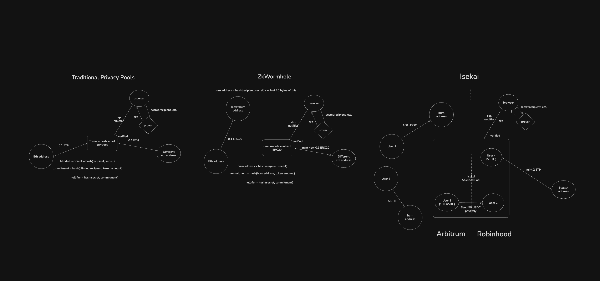

# Isekai

Isekai is a cross-chain privacy protocol inspired by EIP-7503 and combines shielded UTXO transfers, zk-wormholes, chain abstraction, and delegated execution for any asset.

All commits prior to Arbitrum Founder House can be found on `pre-arbfh` branch.

## What This Repo Contains

This monorepo includes:

- `contracts/`: Foundry smart contracts for the master pool, branch pools, wormholes, verifier integration, and tests.
- `circuits/`: Noir circuits and proof tooling for shielded transfers, delegated transfers, batch proofs, and ragequit flows.
- `webapp/`: Next.js app for the user-facing experience and server-side market fulfillment execution.
- `services/`: supporting services such as screening, master tree syncing, notes vault storage, and the market proof service.
- `subgraph/`: Graph subgraph for indexing shielded pool activity and related events.

## Isekai vs Other Privacy Protocols

The diagram below illustrates the difference between a traditional privacy pool deposit, a zk-wormhole-based deposit, and the broader Isekai model.



### Key Difference

- Traditional privacy pools: users publicly call the privacy contract to enter the pool.
- ZK-wormholes: users send assets through ordinary-looking transfers that can later be proven into a shielded balance.
- Isekai: combines zk-wormholes, cross-chain state syncing, delegated execution, and screening into one privacy system.

## How The System Fits Together

At a high level:

1. A sender creates a normal-looking transfer or wormhole-style transfer.
2. Offchain proving infrastructure generates the zero-knowledge proof for the shielded action.
3. Branch pools verify shielded transfers locally.
4. Branch state is aggregated into the master pool for cross-chain synchronization.
5. The webapp and services coordinate proving, indexing, screening, and delegated execution.

## Prerequisites

You will likely need:

- [Bun](https://bun.com/) for the monorepo, webapp, circuits tooling glue, and services.
- [Foundry](https://book.getfoundry.sh/) for smart contract builds and tests.
- Noir tooling such as `nargo` and `bb` for circuit compilation and verifier generation.
- Graph CLI if you want to build or deploy the subgraph locally.

## Getting Started

Install workspace dependencies from the repo root:

```bash
bun install
```

## How To Run The Repo

### 1. Smart Contracts

Build and test the contracts:

```bash
cd contracts
forge build
forge test
```

### 2. Circuits

Build the Noir circuits:

```bash
cd circuits
bun run build
```

Export compiled circuit artifacts for the webapp:

```bash
cd circuits
bun run export-app
```

Export Solidity verifiers for the contracts:

```bash
cd circuits
bun run export-contracts
```

Run circuit tests:

```bash
cd circuits
bun test tests/*
```

### 3. Web App

Start the Next.js app:

```bash
cd webapp
bun run dev
```

The webapp script expects environment configuration such as RPC URLs, contract addresses, subgraph URLs, and in some flows a `RELAYER_PRIVATE_KEY`. There is a `webapp/.env.template` file in the repo to use as a starting point.

### 4. Market Proof Service

Run the market proof service:

```bash
bun run services/market-proof-service/src/index.ts
```

This service is used by the market fulfillment flow to build delegated proofs and batched delegated proofs.

### 5. Supporting Services

Several auxiliary services can be run directly with Bun, for example:

```bash
bun run services/screener/src/index.ts
bun run services/master-tree-updater/src/index.ts
bun run services/notes-vault/src/index.ts
```

These services use their own environment variables and templates where provided under `services/`.

### 6. Subgraph

Build the subgraph:

```bash
cd subgraph
bun run codegen
bun run build
```

For local Graph Node workflows:

```bash
cd subgraph
bun run create-local
bun run deploy-local
```

## Suggested Local Dev Flow

For a typical end-to-end local workflow:

1. Install dependencies with `bun install`.
2. Build circuits with `cd circuits && bun run build`.
3. Export artifacts with `bun run export-app` and `bun run export-contracts` if you changed circuits.
4. Run contract tests with `cd contracts && forge test`.
5. Start the proof service with `bun run services/market-proof-service/src/index.ts`.
6. Start the webapp with `cd webapp && bun run dev`.
